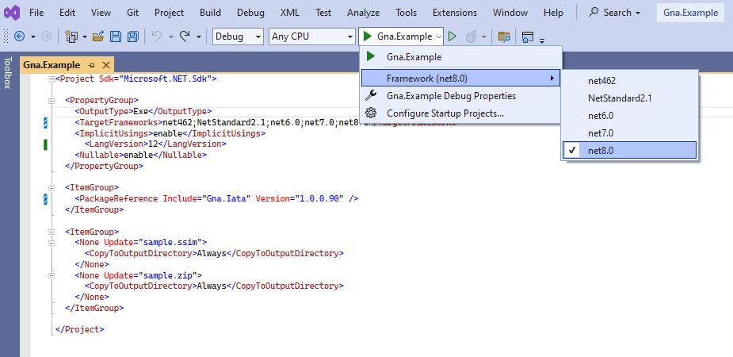

### AvionWorx [Gna.Iata](https://www.nuget.org/packages/Gna.Iata) code examples

### IATA ssim parse read write example
 ```csharp
            using Gna.Iata;

            // Create Ssim reader
            var ssimReader = SsimReader.Create();

            // Read
            var legs = ssimReader.ReadFromFile("sample.ssim");

            // Create Ssim writer, with LocalTime output
            var ssimWriter = SsimWriter.Create(legs, new SsimWriterOptions() { LocalTime = true });

            var newFileName = System.IO.Path.GetRandomFileName() + ".ssim";

            // Save
            ssimWriter.SaveToFile(newFileName);
```
---
**NOTE**

### This is multi-target project.

---

